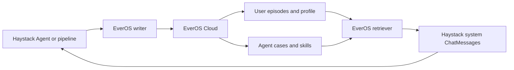

# everos-haystack

[](https://pypi.org/project/everos-haystack)
[](https://pypi.org/project/everos-haystack)

Give Haystack Agents and pipelines durable user memory, reusable agent experience, and cross-session recall with
[EverOS](https://github.com/EverMind-AI/EverOS).

This integration follows the same Haystack surfaces as `mem0-haystack`: configure one memory store, use it through
writer and retriever components, or expose memory as tools that a Haystack Agent can call by itself.

## What is EverOS?

EverOS is an open-source Python memory runtime for agents and makers. Its open-source runtime treats readable
Markdown as the source of truth, with SQLite and LanceDB indexes for structured and semantic retrieval. Instead of
keeping only a flat list of chat snippets, EverOS maintains two first-class memory tracks:

- **User memory** turns conversations into durable episodes, atomic facts, and an evolving profile.
- **Agent memory** turns trajectories into reusable cases and skills that can improve later runs.

EverOS also separates memory by application, project, session, user, and agent. Its broader open-source platform
includes hybrid retrieval, background reflection, and an editable Knowledge Wiki.

The `everos-haystack` package focuses on the memory loop required by Haystack. It connects to the hosted EverOS v2
API at `https://api.evermind.ai`, so users only need an EverOS Cloud API key; no local EverOS server is required.



## What the integration provides

| Haystack surface | Purpose |
| --- | --- |
| `EverOSMemoryStore` | Authenticated client for the EverOS v2 add, flush, and search APIs |
| `EverOSMemoryWriter` | Adds Haystack message streams and optionally forces extraction |
| `EverOSMemoryRetriever` | Retrieves user episodes/profiles or agent cases/skills |
| `EverOSMemoryWriterTool` | Lets an Agent decide which durable facts, preferences, and decisions to store |
| `EverOSMemoryRetrieverTool` | Lets an Agent recall relevant context before it answers |

## Installation

### Requirements

- Python 3.10 or later
- An [EverOS Cloud API key](https://everos.evermind.ai/api-keys)
- A model-provider key only if your Haystack Agent also calls an LLM

Once the integration is released on PyPI, install it with:

```bash
pip install everos-haystack
```

To try an unreleased checkout of `haystack-core-integrations`, install the integration from the repository root:

```bash
pip install -e integrations/everos
```

Export your EverOS Cloud API key:

```bash
export EVEROS_CLOUD_API_KEY="your-api-key"
```

The default store automatically uses the environment variable and the hosted endpoint:

```python
from haystack_integrations.memory_stores.everos import EverOSMemoryStore

store = EverOSMemoryStore()
```

Keep API keys in environment variables or a secret manager. Do not put them in source code.

## Quick start: remember and recall

The following example writes a preference, extracts it at the end of the session, and searches it back. EverOS
updates its retrieval index asynchronously, so the example uses a short bounded retry instead of assuming that a
new memory is searchable immediately.

```python
import time

from haystack.dataclasses import ChatMessage
from haystack_integrations.components.retrievers.everos import EverOSMemoryRetriever
from haystack_integrations.components.writers.everos import EverOSMemoryWriter
from haystack_integrations.memory_stores.everos import EverOSMemoryStore

store = EverOSMemoryStore()
writer = EverOSMemoryWriter(memory_store=store, flush_on_write=True)
retriever = EverOSMemoryRetriever(
    memory_store=store,
    method="hybrid",
    top_k=5,
    include_profile=True,
)

write_result = writer.run(
    [
        ChatMessage.from_user("I prefer concise Python examples."),
        ChatMessage.from_assistant("I'll keep future examples concise."),
    ],
    session_id="quickstart-001",
    user_id="alice",
    agent_id="docs-agent",
)
print(write_result)

memories = []
for attempt in range(6):
    memories = retriever.run(
        "How should I format examples for Alice?",
        user_id="alice",
    )["memories"]
    if memories:
        break
    time.sleep(2**attempt / 2)

for memory in memories:
    print(memory.text)

store.close()
```

Run the complete component example from the integration directory:

```bash
python examples/memory_components.py
```

## Use EverOS as Haystack Agent tools

Components are useful when the application controls when memory is written and retrieved. Tools are useful when the
Agent should make that decision itself.

The writer tool receives `user_id` and `session_id` from Haystack Agent State. The retriever receives `user_id`, so
those identifiers do not have to be exposed as model-generated tool arguments.

```python
from haystack.components.agents import Agent
from haystack.components.generators.chat import OpenAIChatGenerator
from haystack.dataclasses import ChatMessage
from haystack_integrations.memory_stores.everos import EverOSMemoryStore
from haystack_integrations.tools.everos import EverOSMemoryRetrieverTool, EverOSMemoryWriterTool

store = EverOSMemoryStore()
agent = Agent(
    chat_generator=OpenAIChatGenerator(model="gpt-5.4-mini"),
    tools=[
        EverOSMemoryRetrieverTool(memory_store=store, include_profile=True),
        EverOSMemoryWriterTool(memory_store=store, flush_on_write=True),
    ],
    system_prompt=(
        "Search memory before answering when earlier context may help. "
        "Store only durable user facts, preferences, and decisions."
    ),
    state_schema={"user_id": {"type": str}, "session_id": {"type": str}},
)

result = agent.run(
    messages=[ChatMessage.from_user("Remember that I prefer concise Python examples.")],
    user_id="alice",
    session_id="agent-demo-001",
)
print(result["last_message"].text)
store.close()
```

This example also needs the key used by `OpenAIChatGenerator`:

```bash
export OPENAI_API_KEY="your-api-key"
python examples/agent_memory.py
```

For agent-memory retrieval, map Agent State to `agent_id` instead of the default `user_id`:

```python
agent_memory_tool = EverOSMemoryRetrieverTool(
    memory_store=store,
    inputs_from_state={"agent_id": "agent_id"},
)
```

## How the memory lifecycle works

EverOS does not assume that every message is already a useful long-term memory.

1. **Ingest**: the writer appends supported Haystack messages to an EverOS session.
2. **Extract**: EverOS identifies durable episodes, facts, profile updates, cases, or skills at a semantic boundary.
3. **Persist**: extracted memory is written durably by the EverOS memory runtime.
4. **Index**: searchable indexes update asynchronously.
5. **Recall**: the retriever returns relevant memory as Haystack system messages.

`messages_written` therefore means messages accepted by EverOS, not one extracted memory per message.

Set `flush_on_write=True` when a short job must force the current session through extraction before it exits. Keep the
default `False` for ongoing conversations where normal semantic boundaries should control extraction. Even after a
flush, retry search with backoff when your workflow requires read-after-write behavior because index updates are
eventually consistent.

## User memory and agent memory

EverOS keeps knowledge about a user separate from experience learned by an agent. A search must provide exactly one
owner.

```python
# User track: episodes, nested facts, and optional profile
user_memories = retriever.run(
    "Alice's preferences",
    user_id="alice",
)["memories"]

# Agent track: reusable cases and skills
agent_memories = retriever.run(
    "How do I evaluate a database migration?",
    agent_id="database-agent",
)["memories"]
```

Use stable IDs. Passing the wrong `user_id` or `agent_id` intentionally searches a different memory owner.

## Scopes, retrieval, and filters

`app_id` and `project_id` create orthogonal memory scopes. A search never crosses into another scope, even when the
same `user_id` appears in both. Both default to `"default"` for small applications.

```python
memories = retriever.run(
    "What did we decide about the launch?",
    user_id="alice",
    app_id="support-copilot",
    project_id="launch-2026",
    session_id="planning-042",
)["memories"]
```

The retriever supports four EverOS search methods:

| Method | Use it for |
| --- | --- |
| `keyword` | Exact terms, IDs, names, and deterministic lexical matches |
| `vector` | Semantic similarity when the wording may differ |
| `hybrid` | Combined lexical and semantic recall; the default |
| `agentic` | Agent-oriented retrieval with compatible server capabilities |

Haystack metadata-filter syntax is converted to the EverOS filter DSL. Supported fields are `session_id`,
`parent_type`, `parent_id`, `timestamp`, and `sender_id`.

```python
recent = retriever.run(
    "What changed recently?",
    user_id="alice",
    filters={"field": "timestamp", "operator": ">=", "value": 1_750_000_000_000},
)["memories"]
```

Supported comparison operators are `==`, `!=`, `>`, `>=`, `<`, `<=`, and `in`. Logical `AND` and `OR` filters are
also supported.

## Returned memory

Every result is a Haystack `ChatMessage` with `role="system"`, ready to place in a prompt or pipeline. The readable
memory is in `message.text`. Structured provenance is under `message.meta["everos"]`:

```python
for message in memories:
    print(message.text)
    print(message.meta["everos"]["memory_type"])
    print(message.meta["everos"]["request_id"])
```

Depending on the selected track, `memory_type` can be `episode`, `profile`, `agent_case`, or `agent_skill`.
Additional metadata includes source IDs, scope, timestamps, and relevance scores returned by EverOS.

## Examples

| Example | Shows |
| --- | --- |
| [`examples/memory_components.py`](examples/memory_components.py) | Direct writer/retriever use in a pipeline-style application |
| [`examples/agent_memory.py`](examples/agent_memory.py) | A Haystack Agent that decides when to recall and store memory |

## Compatibility and production notes

- The integration targets the canonical EverOS `/api/v2` contract in EverOS 1.2.3.
- The defaults are `https://api.evermind.ai` and `EVEROS_CLOUD_API_KEY`.
- Haystack system messages are not ingested because EverOS accepts `user`, `assistant`, and `tool` roles.
- If no `agent_id` is supplied for assistant or tool messages, the writer uses the stable fallback
  `haystack-agent`. Pass an explicit ID to keep multiple agents' cases and skills separate.
- Keep `session_id`, `user_id`, `agent_id`, `app_id`, and `project_id` stable across calls. They are identity and
  isolation boundaries, not display names.
- Close `EverOSMemoryStore` when a process exits so its underlying HTTP client is released.

## Frequently asked questions

### Do I need to install or run the EverOS open-source server?

No. This package is the hosted integration and connects to EverOS Cloud. The open-source EverOS repository remains
the reference implementation and documents the underlying memory architecture and API contract.

### Why did a successful write return no immediate search result?

Extraction and durable persistence can finish before the search index catches up. Retry with bounded exponential
backoff. A successful write is not lost because the durable memory path and the search index have different timing.

### Is every chat message stored as one memory?

No. EverOS ingests a stream and extracts durable memory at meaningful boundaries. The resulting memory may include
an episode with several atomic facts, a profile update, an agent case, or an agent skill.

### Does this package expose the full EverOS platform?

It currently exposes the Haystack memory loop: add, flush, search, components, and Agent tools. EverOS features such
as Knowledge Wiki administration and reflection orchestration are part of the wider EverOS project but are not
wrapped by this package yet.

## Learn more

- [EverOS source](https://github.com/EverMind-AI/EverOS)
- [EverOS documentation](https://docs.evermind.ai)
- [EverOS API reference](https://github.com/EverMind-AI/EverOS/blob/main/docs/api.md)
- [EverOS Cloud API keys](https://everos.evermind.ai/api-keys)
- [Haystack integration page](https://haystack.deepset.ai/integrations/everos)
- [Changelog](https://github.com/deepset-ai/haystack-core-integrations/blob/main/integrations/everos/CHANGELOG.md)

## Contributing

Refer to the general [Contribution Guidelines](https://github.com/deepset-ai/haystack-core-integrations/blob/main/CONTRIBUTING.md).

To run the live integration tests locally, export `EVEROS_CLOUD_API_KEY` and run the integration test environment.
